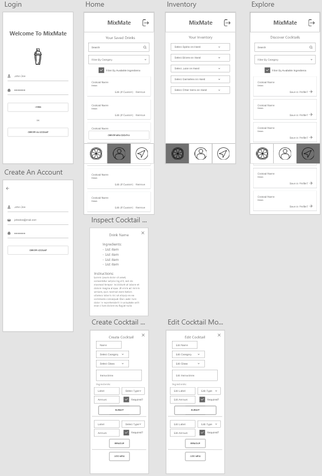
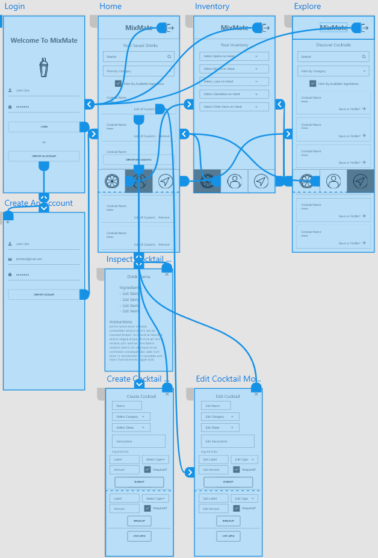
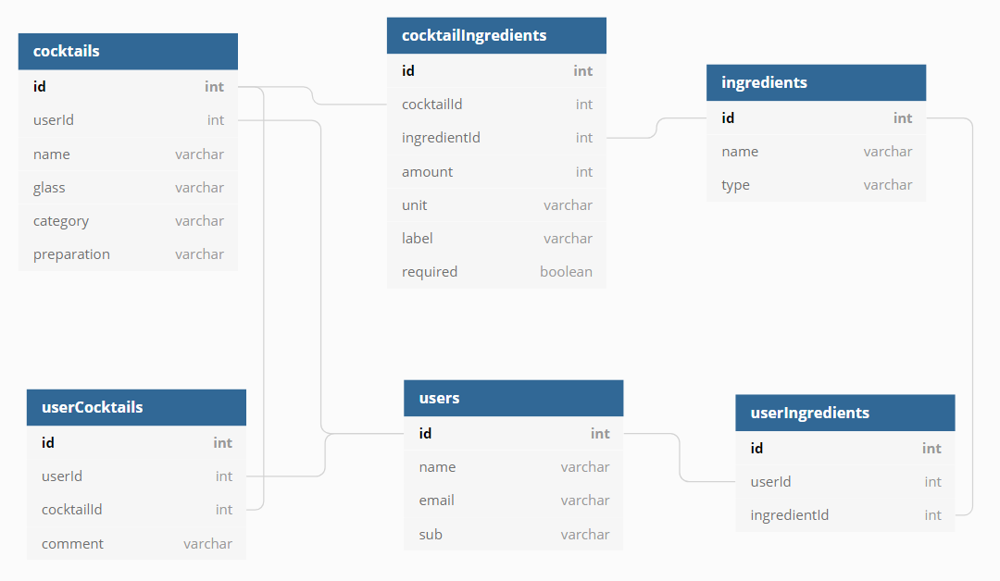

## MIXMATE

MixMate is built to simplify the process of at-home cocktail-making. The app enables the user to create and save cocktail recipes, manage inventory, and determine which cocktails can be made with the ingredients the user has in stock. In addition, MixMate includes a database of cocktails from the International Bartender's Association (IBA) which the user can search and filter through to discover new recipes. The app is styled for mobile-first and can be used on mobile by accessing the URL on the Chrome mobile app or simulated on desktop by toggling a mobile device on browser developer tools. Please below for further information, and enjoy.

### Technologies Used:

- HTML/CSS/JavaScript
- React.js
- React-Select
- Auth0

### Wire Frame:

### ERD:

### Directions to Use:

1. Clone this repo with the "Clone or download" button above this README.
1. Copy the URL generated when the button is clicked.
1. Open your terminal.
1. Type `git clone` and then paste the URL from step 2.
1. Navigate into the root folder using `cd MixMate`.
1. Once in root folder, type `npm install`.
1. Type `npm start`.
1. In another terminal window - navigate into the "api" folder by typing `cd /api`.
1. Run `json-server -p 5002 database.json`.
1. Navigate to localhost:3000.

or:

Visit https://mixmate.herokuapp.com/

* Once in the browser, open developer tools and toggle the device toolbar. Set the view to a mobile device as preferred.
* After steps listed above are complete you should be ready to use the app.

### Nashville Software School Front End Capstone
### &copy; Cole Bryant 2019

